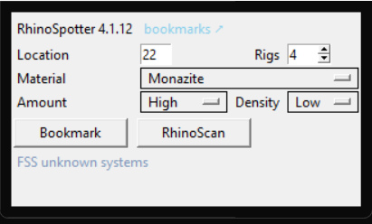
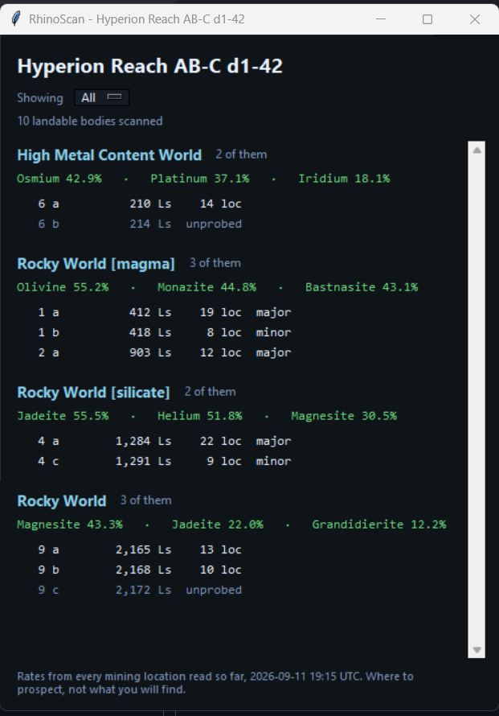

# Installing RhinoSpotter

An EDMC plugin for Elite Dangerous surface mining. Windows, since EDMC is.

---

## 1. Put the folder in place

Download the latest release zip from
[EDRhinoSpotter/releases](https://github.com/Fumlop/EDRhinoSpotter/releases),
and unpack it into EDMC's plugin folder:

```
%LOCALAPPDATA%\EDMarketConnector\plugins\
```

Paste that path into Explorer's address bar, or open EDMC and use
**File → Settings → Plugins → Open**, which takes you straight there.

The folder must be named `RhinoSpotter` and `load.py` must sit directly inside
it:

```
plugins\RhinoSpotter\load.py
plugins\RhinoSpotter\mining_sheet.json
plugins\RhinoSpotter\rs_core\
plugins\RhinoSpotter\rs_ui\
```

A GitHub zip unpacks to `EDRhinoSpotter-main\` or similar. Rename it to
`RhinoSpotter`, or move its contents up one level - EDMC looks for `load.py`
one folder deep and nowhere else.

## 2. Restart EDMC

Plugins load once, at startup. There is no reload button, and editing files
while EDMC runs changes nothing until it is restarted.

You should see this in the main window:



If you do not, check **File → Settings → Plugins** - a plugin that failed to
load is listed there with its error.

---

## Using it

### RhinoScan - which bodies here are worth landing on



One row per landable body, grouped by what kind of body it is, with the
materials that kind has been found to hold above it. Percentages are the share
of that ground's mining locations that carried the material; `unprobed` means
nobody has counted the locations on that body yet, which is not the same as
there being none.

**Bodies come from Spansh and your journal.** When you honk, Spansh is asked
for the system's known landable bodies - planet class, volcanism, gravity,
mining location count - once a session per system. Your own scans replace them.

In a system Spansh does not know, or offline, the honk is not enough:
`FSSDiscoveryScan` finds the bodies but does not describe them, so:

- honk, then work the FSS and resolve the bodies, or
- fly in and let the auto-scan sweep the near ones.

A system where none of that happened shows nothing, and the window says so.

**Bookmarks you already made.** A body you have marked before shows
"2 bookmarks" behind it. Clicking lists them in the same window: one row per
bookmark with the location, material, rigs, heading, coordinates and when it
was marked, grouped by location, most rigs first. **Back** returns to the body
list, and **Share map** beside a location opens the picture of the map its
bookmarks are on. Bodies with none say nothing.

**Guide.** An arrow over the game, top middle, pointing at that patch with the
distance under it. Elite must run borderless or windowed - nothing draws over
an exclusive fullscreen. **Stop** on the same row takes it down, and so does
six seconds of having nothing to point at.

**Active / Depleted.** Marks the patch mined out (red) or not (green); the
bookmark keeps when it was marked.

**Delete.** Removes that bookmark from disk, after asking.

**Loc.** Landing fills it in by itself, from the mining location the game says
you came down nearest to. Type over it if it picked the wrong one.

**Filtering.** Pick a material in the panel and the window lists only the
ground that carries it, each group leading with its rate for that material.
**All** puts everything back. A system where nothing carries it says so
instead of opening empty.

Systems are remembered. Every scan is written to
`%LOCALAPPDATA%\RhinoSpotter\data\<System>.json` as it happens, so jumping back
weeks later opens already filled.

### Bookmark - the patch you are standing on

1. Land, put the rigs down.
2. Pick the **Material** and set **Rigs**. `Location` fills itself while the
   mining location is your selected destination; otherwise type the number.
3. Press **Bookmark**.

`completed` appears on the button once the bookmark is on disk, in
`%LOCALAPPDATA%\RhinoSpotter\cards\<System>\`. The **cards folder** link in
the panel header opens it.

Everything in it is read from `Status.json` at the press. It is live-only:
position and selected location are gone the moment you fly off, so bookmark
before you leave. Marking the same location for the same material twice gives
you two bookmarks, not one overwritten.

---

## Updating

When a newer release is out, **Bookmark** reads **Update** instead and the
status line names the version - checked at start and every hour after. Press
it; the release is fetched and unpacked in place, and the button reads
**Restart EDMC**.

On 2.9.0 to 4.0.0 the button could stay grey when EDMC started docked. If you
never saw a working Update there, download `RhinoSpotter-4.0.1.zip` (or newer)
from the releases page and unpack it over the plugin folder once.

The mining sheet is replaced by every update. Kept: everything under
`%LOCALAPPDATA%\RhinoSpotter\` - your bookmarks, maps and scanned systems are
not in the plugin folder and are never touched.

### Testing the update without a throwaway release

    set RHINOSPOTTER_VERSION=1.0.0

Start EDMC from that same prompt. The plugin reports itself as 1.0.0, so the
current release looks new and the button appears. What it installs is still
whatever the release actually contains.

---

## What it does not do

- **Network: the update check, and Spansh when you honk.** Bodies come from
  your journal; on the honk Spansh is asked for the ones you have not
  scanned (`spansh.co.uk/api/dump/<SystemAddress>`). Offline, the journal
  alone fills the list. Rates come from the file shipped beside `load.py`.
- **It cannot tell you what a mining location holds.** That list exists only
  in the in-game target panel - no journal event and no feed carries it. The
  percentages say where to prospect, not what you will find.

---

## If something is wrong

**The panel is missing.** EDMC not restarted, or the folder is nested one
level too deep. `plugins\RhinoSpotter\load.py` has to exist exactly.

**The scan window is empty in a system you honked.** Spansh did not know the
system, or could not be reached (EDMC's log says which), and honking is not
scanning. Resolve the bodies in the FSS.

**"mining_sheet.json is missing".** The file did not come along. Copy it back
beside `load.py` from the release zip; the body list still works without it,
the percentages do not.

**Anything else.** EDMC's log has it: **File → Settings → Plugins → Open Log
Folder**, then look for lines from `RhinoSpotter`.
