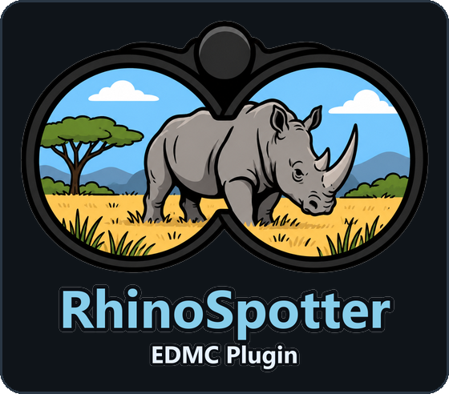

<h1 align="center">
  
</h1>

EDMC plugin for Elite Dangerous surface mining: which bodies to land on,
bookmarks for the patches you find, a minimap of the ground you have scanned,
and an arrow that guides you back.

<p align="center">
  
</p>

## Install

Unpack into `%LOCALAPPDATA%\EDMarketConnector\plugins\RhinoSpotter\` so that
`load.py` sits directly inside, and restart EDMC. Details: [INSTALL.md](INSTALL.md).

Updates: when a release is out, **Bookmark** reads **Update**. Press it, then
restart EDMC. Your data is not in the plugin folder and is never touched.

## RhinoData - where to land

<p align="center">
  
</p>

- The rail lists the landable bodies of the current system, grouped by ground
  type, each with its distance, how many mining locations it has and how many
  bookmarks you carry on it. Picking one fills the middle and the card.
- Over the body: the share of that ground's mining locations that carried each
  material and the median price it sells for - the best three you can pick, so
  the low value switch below decides what it names. Green is a material this
  body already has a bookmark for.
- Picking a bookmark draws the saved map it lies on over its card: the ground
  driven around it, every bookmark of the body on it, no legend.
- **Edit** at the end of a deposit row opens the bookmark for correction:
  material, rigs, amount, density and location. Coordinates, heading and the
  time it was marked are readings and stay as they were.

<p align="center">
  
</p>

- Standing on the deposit again and pressing **Bookmark** does the same for
  rigs, amount and density without opening anything: a mark within 100 m of a
  bookmark for the same material updates it instead of adding a second.
- **Bodies:** honk, and Spansh is asked for the system's known bodies, until
  your own FSS scan or fly-by replaces them. The line
  under the buttons says when to FSS instead: a new system, no Spansh bodies,
  Spansh unreachable, or Spansh knowing fewer bodies than the honk counted
  ("Spansh 31/40 bodies - FSS for the rest").
- **Spansh is asked as little as possible:** only on the honk, once a session per
  system, never for undiscovered systems, not again for 30 days after it
  answered for a system, and not for an hour after a failed request.
  `unprobed` = nobody counted the locations yet.
- **Material** dropdown: pick one and only grounds that ever carried it are
  listed, with its rate first. Bookmark counts then count only that material.
  Which materials it offers depends on the low value switch under Settings.

<p align="center">
  
</p>
<p align="center"><em>The same system with Material set: the grounds that never
carried it are gone.</em></p>

- Clicking a body in the rail fills the middle with its bookmarks, folded into
  their mining locations, and the card on the right with the one that is
  picked. **Bookmarks** and **Mapped N/M** are tabs on the body, not pages.

<p align="center">
  
</p>
<p align="center"><em>The Mapped tab: the locations this body has a saved map
for, and the maps that no location could be tied to.</em></p>

- On or over a body, RhinoData opens straight on that body's bookmarks.
- Rates, not contents: no journal says what a location holds.

## Bookmark - the patch you are on

1. Land, put the rigs down.
2. Pick **Material**, set **Rigs**. **Location** fills itself on landing (nearest
   bookmark within 3 km, else the journal's guess) - type over it if wrong.
   Taking off clears it.
   **Amount** / **Density** from the HUD are optional.
3. Press **Bookmark** - the button says `completed`.

- Position comes from `Status.json` at the press: bookmark before you leave.
- Same material within 100 m of an existing bookmark updates its Amount and
  Density instead of adding a new one.

<p align="center">
  
</p>

A location line says how many deposits it holds, which materials, how many are
worked out, how far the nearest one is, and carries **Share map** - the saved
map picture for that location. Clicking it folds the location away. On the card
of the picked bookmark:

- **Guide** - arrow over the game (top middle) with direction and distance,
  from orbital cruise down to the SRV. Borderless or windowed.
- **Mark depleted / Set active** - mark a patch mined out.
- **Copy coords** - the coordinates onto the clipboard.
- **Delete** - asks first.
- With Rigs and Amount set, an estimated tons-left range is shown (experimental).

<p align="center">
  
</p>

## Minimap - ground you have covered

<table align="center">
  <tr>
    <td align="center"></td>
    <td align="center"></td>
    <td align="center"></td>
  </tr>
  <tr>
    <td align="center"><em>Droppoint</em></td>
    <td align="center"><em>Center set</em></td>
    <td align="center"><em>Center and border</em></td>
  </tr>
</table>

- Shows while in the SRV. Paints a 2 km disc (scanner range) wherever you drive.
  12 km across, north up, 1 km grid.
- **Ctrl+Alt+Z** - set the location's center where you stand. A set center is
  a blue dot on the map, smaller than a bookmark.
- **Ctrl+Alt+B** - set the border where you stand (needs a center). Rings then
  show the drive circles; ground outside the border is dropped.
- **Ctrl+Alt+M** - zoom: 1x, 2x, 4x and back. 2x doubles the map; 4x keeps the
  2x window and shows 6 km across instead of 12. Frame and text rows never
  scale. Capped at 640 px of map. Sticks across EDMC restarts.
- Bookmarks are dots with material codes: green active, red depleted.
- At 2x the bookmarks are joined up, each line carrying its length:
  - **solid** to the nearest bookmark of the **same material** - where to go to
    keep mining what you are mining;
  - **dotted** to the nearest bookmark of the **next material down** in price -
    where to go to settle for less.

  Each number sits beside the middle of its own line, never past an end - out
  there it would be next to somebody else's line and read as that one's. The
  center is not joined to anything; it is just the blue dot. The smallest map
  draws none of it: 12 km of ground in 250 px has no room for a number and the
  lines cover the painted area they cross. A number with nowhere free to sit is
  left off; press Ctrl+Alt+M to read the rest.
- Saved per body; a launch within 10 km carries on the same map, EDMC restarts
  included. Each dock saves a picture with a legend of the bookmarks on it.
- The picture circles golden groups in gold: bookmarks within 2.5 km of one
  point, not depleted, 5 or more rigs together - one Rhino stop.
- Hidden while Elite is not the front window.
- "Painted" means driven within 2 km, not proven scanned - the game logs no scan.

<p align="center">
  
</p>
<p align="center"><em>Ctrl+Alt+M: 2x, the size that draws the distances.
Solid joins a material to itself, dotted steps down to the next.</em></p>

<p align="center">
  
</p>

## Settings

EDMC Settings, RhinoSpotter tab:

<p align="center">
  
</p>

- Minimap on/off, whether it stays up when you alt-tab out of the game, and
  its corner.
- **Free move** - the map sits where you dragged it instead of in a corner.
  **Place the map** takes the mouse for a moment: drag it, then double-click
  or press Esc. The position is kept as an offset from the game window, so
  moving or resizing Elite takes the map with it.
- Saved maps count and size, **Open folder** for the map pictures.
- **Delete migrated JSON** - after upgrading to 4.2, removes the old JSON files
  the database already holds.
- **Show materials under 50,000 Cr/t** - off by default. Off, the Material
  dropdown, the RhinoData picker and the rates line carry 18 materials; on,
  all 38. Price is the median, best across grounds. Exceptions either way: a
  material you already have a bookmark for, and one you are mining right now.
- **Hotkeys** - a modifier set (Ctrl+Alt, Ctrl+Shift, Alt+Shift, Ctrl+Alt+Shift)
  and a key (A-Z, 0-9, F1-F12) for each of the four. The keys named in this
  README are the defaults; the rows under the minimap show the ones in use.

## For other plugins and tools

`rs_api.py` reads the bookmarks back out, read-only, from inside EDMC or from
a separate program: `bookmarks()`, `bodies()`, `revision()`, `version()`. Keys
are added, never removed, while `rs_api.SCHEMA` reads 1 - the storage itself
has moved before and is not a promise. See **[docs/API.md](docs/API.md)**.

```python
import rs_api

for mark in rs_api.bookmarks(system="Aramo"):
    print(mark["body"], mark["location"], mark["material"], mark["depleted"])
```

## Data

Stored locally. Network: Spansh when you honk (`spansh.co.uk/api/dump/<SystemAddress>`,
once a session per system), GitHub for the update check.

| What | Where |
|---|---|
| Bookmarks, scanned bodies, map points | `%LOCALAPPDATA%\RhinoSpotter\db\rhinospotter.db` |
| Backups (last 2, on EDMC close) | `%LOCALAPPDATA%\RhinoSpotter\db\backups\` |
| Map pictures | `%LOCALAPPDATA%\RhinoSpotter\coverage\<Body>\map N.png` |
| Material rates | `mining_sheet.json` in the plugin folder |

## Tools

    python -m rs_core.replay --days 7 --rebuild    # load bodies from older journals - run after installing
    python -m rs_core.replay --days 3              # rank recent systems
    python -m rs_core.replay --days 3 --testmode   # put the best one in the cache

Debug log: set `RHINOSPOTTER_DEBUG=1` before starting EDMC.

Tests: `pytest` - no network, game or display. Code layout: `structure.md`.
