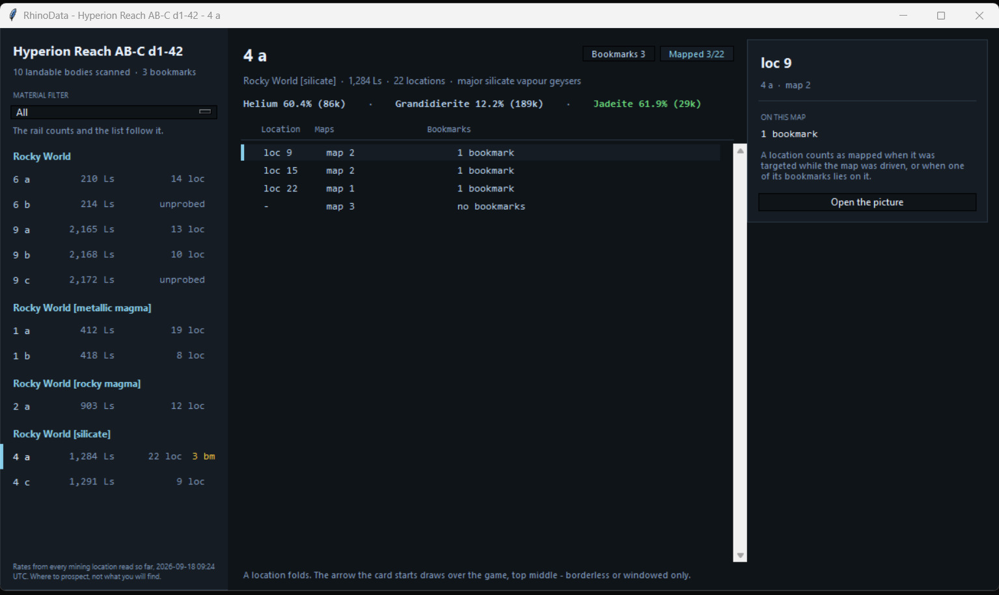

<h1 align="center">
  
</h1>

EDMC plugin for Elite Dangerous surface mining. Two buttons.

  

## RhinoScan - which bodies here are worth landing on

Press **RhinoScan**. A window opens listing the landable bodies of the system
you are in, grouped by what kind of body they are, with what that kind has
been found to hold above it.

  

*Example system. Percentages are the share of that ground's mining locations
that carried the material; `unprobed` means nobody has counted that body yet,
and those rows are dimmed. A body you have already marked shows how many
bookmarks it has, and one you have driven a map on shows how many of its
locations are mapped - click either and the window lists them.*

### The bookmarks of one body

**On or over a body** - in the SRV, landed, or in orbital cruise - **RhinoScan
opens straight on that body's bookmarks**, even before it has any. **Back**
goes to the body list.

Clicking `3 bookmarks` puts the list in the same window: one row per bookmark
with the location, material, rigs, heading, coordinates and when it was
marked, grouped by location. **Most rigs first** within a location - of the
patches you bookmarked there, the best one is the top row. **Back**, top left,
returns to the body list.

  

Under the bookmark count: the **three best-paying materials** for that kind of
body - rate times median price, the same pick as the body list - each with its
rate and median price per tonne. A
body the journal has not described yet says so instead.

The dropdown beside the body name narrows the list to **one material's
bookmarks**; it offers only materials this body has bookmarks for.

**Share map**, beside each location, opens the picture of the map that
location's bookmarks were made on - see [Sharing a map](#sharing-a-map).

<experimental>
**Tons left.** A bookmark with Rigs and Amount shows a range under it:
`High amount · Low density · ≈ 620-1,200 t left`. A deposit holds about
275-300 t for every rig position that fits on it - measured on one Monazite
deposit, High Amount / Low Density, four positions, 1,150 t mined to Depleted
by two commanders - and Amount reads as the share left (High 57-100 %, Medium
27-67 %, Low up to 34 %). Density is saved and shown, but not used until an
effect is confirmed. </experimemtal>

### Which locations you have mapped

`Mapped 3/22` on a body row counts the mining locations you have driven a map
on, out of all the body has. Click it and the window lists them, with
**Back** top left: each location, the maps on it, how many bookmarks it has
and **Share map**. A location counts when you had it targeted while driving
the map, or when one of its bookmarks lies on the map. A map tied to neither
is listed under *location unknown*, so no drive goes missing.

  

**Active** / **Depleted**, before Guide, marks a patch as mined out: green
while it still has something, red once marked, a press flips it. The bookmark
keeps when it was marked (`depleted_at`), so once the community knows how long
a patch takes to refill, that can be counted from it.

**Delete** removes that bookmark from disk, after asking. The last one on a
body takes you back to the body list.

**Loc fills itself in when you land or drop the SRV.** Within 10 km of a
bookmark on that body, it takes the nearest bookmark's location - the panel says
"loc 13 from a bookmark 350 m away". Otherwise the `Touchdown` journal event's
nearest location stands in. Two locations close together can give the wrong
number either way - at a location you have not bookmarked yet, a neighbour's
bookmark can be the nearest - so it is a suggestion you can type over.

**Guide** puts an arrow over the game: top middle of the Elite window,
click-through, showing the direction to that patch and how far. It works from
orbital cruise down to the SRV. Borderless and windowed are what it is built
for; fullscreen usually works too. It hides while Elite is not the window in
front - alt-tabbed out, or the game not running - and comes back without
taking focus. If it cannot be put up at all it says so in the log and nothing
else changes.

  

The arrow points relative to your nose while the game gives a heading. Higher
up it gives none, and the arrow then points north-up, dimmed and labelled with
the compass point. On the wrong body or too high for coordinates there is no
arrow at all, just a line saying which - and after ten seconds of having
nothing to point at, the overlay closes itself. Press **Stop** on the same
row, or **Guide** on another one, to move it.

### Filtering to one material

The **Material** dropdown does two jobs. It names what goes on a card, and it
decides what RhinoScan shows.

Leave it on **All** and the window answers "what is here". Pick a material and
it answers "where is the monazite" instead: only the ground that has ever
carried it is listed, and that material leads every group in blue, with its
rate for that ground.

  

The metal-rich ground has gone - no monazite has ever been read on it. What is
left reads 45.6% on magma, 7.9% on silicate and 2.4% on quiet rocky ground,
which is the whole reason those three are separate groups rather than one
"rocky".

A ground listed because it carries something still says so at 2.4%. The rate is
what you decide on, and a low one you can see beats a low one that was hidden
for being low. A system where nothing carries it tells you that, rather than
opening empty.

**All** puts everything back.

### Where the data comes from

The bodies come from the journal. **The honk alone is not enough**: it finds
the bodies but does not describe them, and only a body the FSS has resolved
carries the planet class and volcanism this reads. Honk, then work the FSS - or
fly in and let the auto-scan sweep the near ones.

The location count comes from the journal too: the FSS reports it without you
flying out there, and a detailed surface scan confirms it. A body nobody has
counted says `unprobed` rather than `0 loc` - none found and none looked for
are not the same thing.

Systems are remembered. Every scan, count and jump is written to
`%LOCALAPPDATA%\RhinoSpotter\data\<System>.json` the moment it happens, so a
crash costs nothing. Jump back in later and the system arrives already filled;
anything you scan after that is added to it. Nothing is asked of EDSM or
anyone else's server - this is your own scan data going to disk and coming
back.

The percentages come from `mining_sheet.json`, the mining sheet shipped beside
`load.py`. Neither half touches the network. Losing the JSON costs the
percentages, not the body list.

**These are rates, not contents.** What a mining location actually holds is in
no journal event and on no feed. This says where to prospect; it cannot say
what you will find.

## Bookmark - the patch you are standing on

1. Land and put the rigs down.
2. Pick the **Material**, set **Rigs**. `Location` fills itself when a mining
   location is the selected destination; otherwise type the signal number.
   Target the deposit and pick its **Amount** and **Density** as the HUD shows
   them - optional, but without them the bookmark cannot estimate the tons left.
3. Press **Bookmark**. `completed` appears on the button once it is on disk.

Coordinates, body, heading and location are read out of `Status.json` at the
press - it is live-only, so bookmark before you fly off. Bookmarking the same
material again within 100 m of an existing bookmark on that body updates it
instead of adding one: only **Amount** and **Density** change (the ones you
picked), position, rigs and time stay, and an Amount other than Depleted takes
its Depleted mark off. 100 m covers an eight-rig patch on flat ground plus 10 %.
Further away, or another material, is a new bookmark. The bookmark shows on the minimap at once, and in the map picture
the next time the SRV docks.

Bookmarks land in `%LOCALAPPDATA%\RhinoSpotter\cards\<System>\`. The
**bookmarks** link in the panel header opens the folder in Explorer.

## Minimap - the ground the scanner has been driven over

<table align="center">
  <tr>
    <td align="center"></td>
    <td align="center"></td>
    <td align="center"></td>
  </tr>
  <tr>
    <td align="center"><em>Droppoint</em></td>
    <td align="center"><em>Center set</em></td>
    <td align="center"><em>Center and border</em></td>
  </tr>
</table>

Launch the Rhino and a map comes up in a corner of the game. Wherever you
drive, a 2 km disc - the scanner's range - is painted in, and the discs run
together into the ground you have covered. North is up, the SRV stays in the
middle and the ground scrolls under it. Two thin rings, 3.75 and 5.5 km out,
sit around the **Droppoint** - where the SRV came out of the ship - and the footer
says how far and which way it is, and how many km² are painted.

- **Ctrl+Alt+Z sets the center.** Drive to the middle of the mining location
  and press it: the map is rebuilt around where you stand, the rings move
  there, and the footer points to the **Center** instead of the droppoint.
  The center is saved with the map.
- **Ctrl+Alt+B sets the border.** Drive to the edge of the location and press
  it: its distance from the center becomes the location's border, drawn as a
  bold circle and saved with the map. Needs a center first - without one the
  map says "set center first". No border set is fine; nothing is drawn.
- **With center and border, the map plans the drive.** The thin rings are the
  circles to drive round the center, counted out from it: the first at 3.75 km,
  each next 1.75 km further, until one scans out to the border (2 km scanner
  range). Painted ground outside the border is deleted from the map, and
  driving outside it paints nothing.
- Both hotkeys are Windows-wide while EDMC runs, and listed under the map. If
  another program already holds one, EDMC's log says so and the other still
  works.

- **Painted means driven within 2 km, not scanned.** Nothing the game writes
  says a scan happened. The 2 km is the community figure; Frontier has not
  published one.
- **Ship hops keep the map and paint nothing.** Dock, fly 3 km, launch again,
  and it carries on painting the same area; the rings and the footer move to
  the new droppoint, because that is where the ship is. A launch more than
  10 km from the map's center, or on another body, starts a fresh map. Driving past 10 km says **out of
  range** and stops painting.
- **Size follows the game window**: 22% of its height, between 180 and 480 px.
  The map always shows 12 km across with a 1 km grid, so 1080p is about 50 m a
  pixel, 85% opaque. Hidden while the game is minimised or not the window in front;
  painting carries on meanwhile.
- **Bookmarks show as dots** on the body they were made on - green while active, red once marked
  depleted - with the material's code beside it: the most valuable material
  gets one letter (Thortveitite **T**), a cheaper one sharing it gets two
  (Thorium **TH**, Titanium **TI**). A new bookmark is on the map the moment you press Bookmark. That
  press is a click in EDMC, which hides the map until you are back in the game.
- **Settings**: EDMC Settings, RhinoSpotter tab - the minimap on (default) or
  off, and top left, top right, bottom left or bottom right.
- **Saved.** The painted area is written to
  `%LOCALAPPDATA%\RhinoSpotter\coverage\<Body>\` as the points it was painted
  from, and a launch within 10 km of a saved map on that body carries it on,
  EDMC restarts included. Each time the SRV goes back into the ship the whole
  map is also saved as a picture beside it, bookmarks included, `map N.png`, 400 px at 50 m a
  pixel. The Settings tab shows how many maps there are and how much space
  they take, with a button to open the folder.

### Sharing a map

  

*Example map picture, invented system. What **Share map** opens.*

Each time the SRV docks, the whole map is written as `map N.png`: body and
system, the planet from the honk, the locations its bookmarks were made at,
the km² prospected and when. Under the map, one row per bookmark on it - code,
material, coordinates and rigs - so whoever you send it to can fly straight
to the patch. The rings are left out; they only say where your ship was. A
centered map names its center coordinates in the title, and a border is drawn
and named too.
## Logging

RhinoSpotter keeps out of EDMC's log: only warnings and errors are written.
To see everything - including why the minimap is down whenever that changes -
set the environment variable `RHINOSPOTTER_DEBUG=1` before starting EDMC.

## Install

See [INSTALL.md](INSTALL.md). Short version: unpack into
`%LOCALAPPDATA%\EDMarketConnector\plugins\RhinoSpotter\` so that `load.py`
sits directly inside, and restart EDMC.

When a newer release is out, **Bookmark** reads **Update** instead and the
status line names the version - checked at start and every hour after. Press
it and the release is fetched and unpacked in place, then it reads **Restart
EDMC**. There is no third button: the panel stays the same width in every
state. The check reads GitHub's releases page, not its API, so a busy network
does not hit the API's hourly limit.

**On 2.9.0 to 4.0.0 and never saw Update?** Those versions could show it grey
and unpressable when EDMC started docked. Download `RhinoSpotter-4.0.1.zip` (or
newer) from the releases page and unpack it over the plugin folder once.

An update brings the current mining sheet. Bookmarks, maps and scans are
never touched - they live under `%LOCALAPPDATA%\RhinoSpotter\`, not in the
plugin folder.

## Seeing it without flying anywhere

    python -m rs_core.replay --days 3

Ranks the systems in your recent journals by how much good ground they hold,
so you can argue with the scoring before it ends up on a panel.

    python -m rs_core.replay --days 3 --testmode

Writes the best of them into the cache, so the next EDMC start arrives in it
and RhinoScan has something real to draw.

    python -m rs_core.replay --days 7 --rebuild

Writes **every** system it finds into the cache. EDMC replays the journal file
it is watching and nothing older, so bodies you scanned in an earlier session
never reached the plugin - they are in a file EDMC will never read. This is how
they get in, and it is what to run after installing.

## Tests

    pytest

164 checks, no network, no game, no display. See `structure.md` for how the
code is laid out and why.
