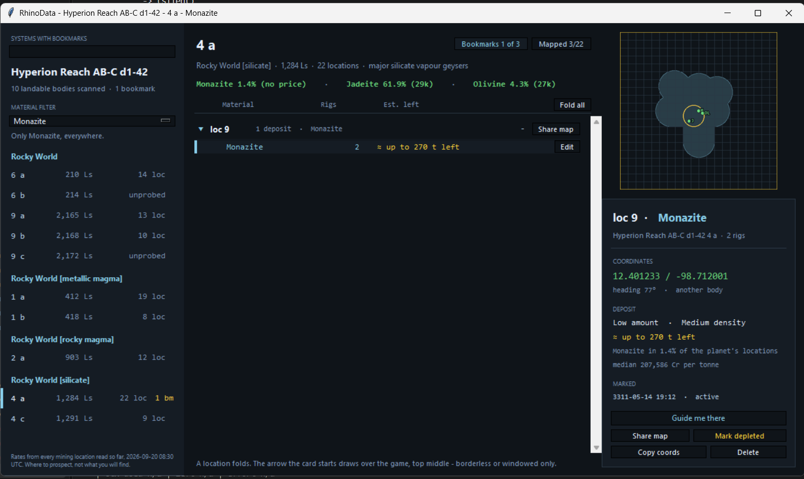
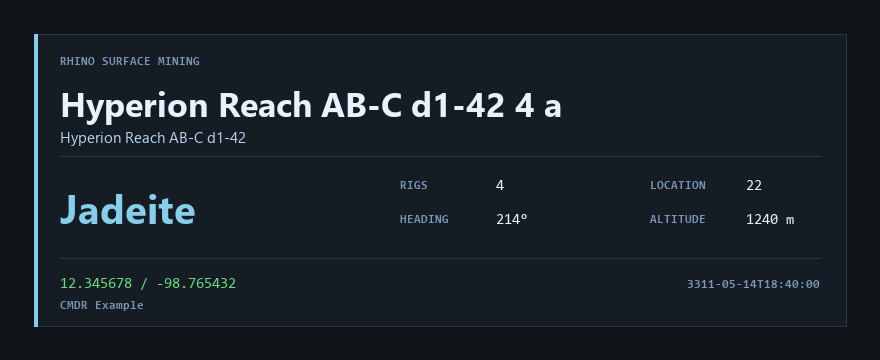

# RhinoSpotter

EDMC plugin for Elite Dangerous surface mining. Two buttons.

  

## RhinoScan - which bodies here are worth landing on

Press **RhinoScan**. A window opens listing the landable bodies of the system
you are in, grouped by what kind of body they are, with what that kind has
been found to hold above it.

  

*Example system. Percentages are the share of that ground's mining locations
that carried the material; `unprobed` means nobody has counted that body yet,
and those rows are dimmed. A body you have already marked shows how many
bookmarks it has - click and the window lists them.*

### The bookmarks of one body

Clicking `3 bookmarks` puts the list in the same window: one row per bookmark
with the location, material, rigs, heading, coordinates and when it was
marked. **Most rigs first** - of the patches you bookmarked on this body, the
best one is the top row. **Back**, top left, returns to the body list.

  

Each row carries three buttons. **Card** opens that bookmark's PNG in whatever
shows PNGs here, which is the thing that can then send it on.

**Delete** removes that bookmark from disk, the card and its sidecar, after
asking. The last one on a body takes you back to the body list.

**Loc fills itself in when you land.** The `Touchdown` journal event names the
mining location you came down at, so the number is in the panel before you
have stopped rolling. It is the nearest one, not the one you targeted - two
locations close together and it can name the wrong one, so it is a suggestion
you can type over.

**Guide** puts an arrow over the game: top middle of the Elite window,
click-through, showing the direction to that patch and how far. It works from
orbital cruise down to the SRV. Borderless and windowed are what it is built
for; fullscreen usually works too. If the Elite window cannot be found the
arrow parks in the middle of the screen, and if it cannot be put up at all it
says so in the log and nothing else changes.

  

The arrow points relative to your nose while the game gives a heading. Higher
up it gives none, and the arrow then points north-up, dimmed and labelled with
the compass point. On the wrong body or too high for coordinates there is no
arrow at all, just a line saying which - and after ten seconds of having
nothing to point at, the overlay closes itself. Press **Stop** on the same
row, or **Guide** on another one, to move it.

### Filtering to one material

The **Material** dropdown does two jobs. It names what goes on a card, and it
decides what RhinoScan shows.

Leave it on **All** and the window answers "what is here". Pick a material and
it answers "where is the monazite" instead: only the ground that has ever
carried it is listed, and that material leads every group in blue, with its
rate for that ground.

  

The metal-rich ground has gone - no monazite has ever been read on it. What is
left reads 45.6% on magma, 7.9% on silicate and 2.4% on quiet rocky ground,
which is the whole reason those three are separate groups rather than one
"rocky".

A ground listed because it carries something still says so at 2.4%. The rate is
what you decide on, and a low one you can see beats a low one that was hidden
for being low. A system where nothing carries it tells you that, rather than
opening empty.

**All** puts everything back.

### Where the data comes from

The bodies come from the journal. **The honk alone is not enough**: it finds
the bodies but does not describe them, and only a body the FSS has resolved
carries the planet class and volcanism this reads. Honk, then work the FSS - or
fly in and let the auto-scan sweep the near ones.

The location count comes from the journal too: the FSS reports it without you
flying out there, and a detailed surface scan confirms it. A body nobody has
counted says `unprobed` rather than `0 loc` - none found and none looked for
are not the same thing.

Systems are remembered. Every scan, count and jump is written to
`%LOCALAPPDATA%\RhinoSpotter\data\<System>.json` the moment it happens, so a
crash costs nothing. Jump back in later and the system arrives already filled;
anything you scan after that is added to it. Nothing is asked of EDSM or
anyone else's server - this is your own scan data going to disk and coming
back.

The percentages come from `ground_rules.json`, the mining sheet shipped beside
`load.py`. Neither half touches the network. Losing the JSON costs the
percentages, not the body list.

**These are rates, not contents.** What a mining location actually holds is in
no journal event and on no feed. This says where to prospect; it cannot say
what you will find.

## Bookmark - the patch you are standing on, as a PNG

  

*Example card. Everything on it was read from `Status.json` at the press.*

1. Land and put the rigs down.
2. Pick the **Material**, set **Rigs**. `Location` fills itself when a mining
   location is the selected destination; otherwise type the signal number.
3. Press **Bookmark**. `completed` appears beside the button once the PNG is
   on disk.

Coordinates, body and location are read out of `Status.json` at the press - it
is live-only, so make the card before you fly off. Marking the same location
for the same material twice gives you two cards, not one overwritten.

Bookmarks land in `%LOCALAPPDATA%\RhinoSpotter\cards\<System>\`. The
**bookmarks** link in the panel header opens the folder in Explorer.

## Minimap - the ground the scanner has been driven over

  

Launch the Rhino and a map comes up in a corner of the game. Wherever you
drive, a 2 km disc - the scanner's range - is painted in, and the discs run
together into the ground you have covered. North is up, the SRV stays in the
middle and the ground scrolls under it. The green diamond is the
**Droppoint**, where the SRV came out of the ship; the footer says how far and
which way it is, and how many km² are painted.

- **Painted means driven within 2 km, not scanned.** Nothing the game writes
  says a scan happened. The 2 km is the community figure; Frontier has not
  published one.
- **Ship hops keep the map and paint nothing.** Dock, fly 3 km, launch again,
  and it carries on painting the same area from the new droppoint. Droppoints
  are numbered; the latest is bright, because that is where the ship is, and
  the footer points to it. A launch more than 10 km from the first droppoint,
  or on another body, starts a fresh map. Driving past 10 km says **out of
  range** and stops painting.
- **Size follows the game window**: 22% of its height, between 180 and 480 px.
  The map always shows 12 km across with a 1 km grid, so 1080p is about 50 m a
  pixel. Hidden
  while the game is minimised.
- **Settings**: EDMC Settings, RhinoSpotter tab - the minimap on (default) or
  off, and top left, top right, bottom left or bottom right.
- **Saved.** The painted area is written to
  `%LOCALAPPDATA%\RhinoSpotter\coverage\<Body>\` as the points it was painted
  from, and a launch within 10 km of a saved map on that body carries it on,
  EDMC restarts included. Each time the SRV goes back into the ship the whole
  map is also saved as a picture beside it, `map N.png`, 400 px at 50 m a
  pixel. The Settings tab shows how many maps there are and how much space
  they take, with a button to open the folder.

## Install

See [INSTALL.md](INSTALL.md). Short version: unpack into
`%LOCALAPPDATA%\EDMarketConnector\plugins\RhinoSpotter\` so that `load.py`
sits directly inside, and restart EDMC.

When a newer release is out, **Bookmark** reads **Update** instead and the
status line names the version. Press it and the release is fetched and
unpacked in place, then it reads **Restart EDMC**. There is no third button:
the panel stays the same width in every state.

Your exported `ground_rules.json` is kept, and cards and scans are never
touched - they live under `%LOCALAPPDATA%\RhinoSpotter\`, not in the plugin
folder.

## Seeing it without flying anywhere

    python -m rs_core.replay --days 3

Ranks the systems in your recent journals by how much good ground they hold,
so you can argue with the scoring before it ends up on a panel.

    python -m rs_core.replay --days 3 --testmode

Writes the best of them into the cache, so the next EDMC start arrives in it
and RhinoScan has something real to draw.

    python -m rs_core.replay --days 7 --rebuild

Writes **every** system it finds into the cache. EDMC replays the journal file
it is watching and nothing older, so bodies you scanned in an earlier session
never reached the plugin - they are in a file EDMC will never read. This is how
they get in, and it is what to run after installing.

## Tests

    pytest

164 checks, no network, no game, no display. See `structure.md` for how the
code is laid out and why.
