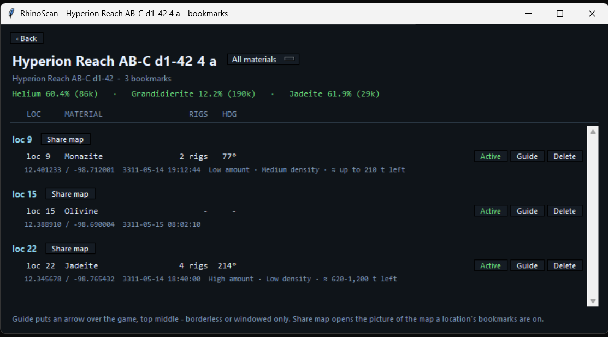
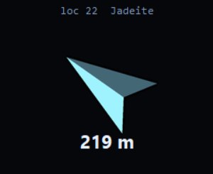
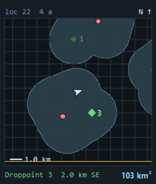
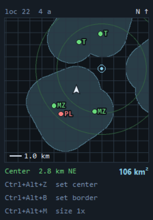
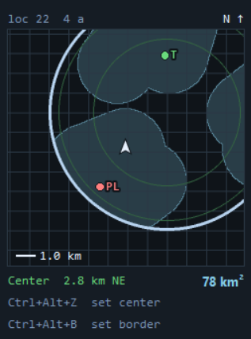
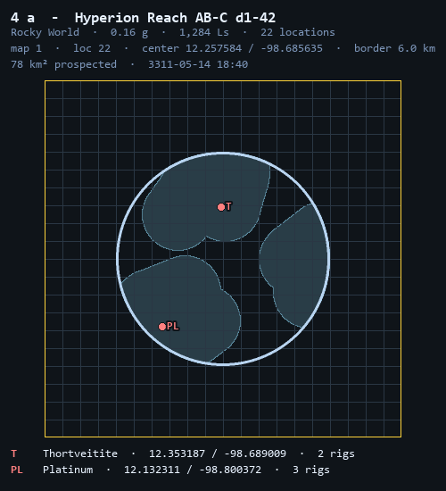

<h1 align="center">
  
</h1>

EDMC plugin for Elite Dangerous surface mining: which bodies to land on,
bookmarks for the patches you find, a minimap of the ground you have scanned,
and an arrow that guides you back.

  

## Install

Unpack into `%LOCALAPPDATA%\EDMarketConnector\plugins\RhinoSpotter\` so that
`load.py` sits directly inside, and restart EDMC. Details: [INSTALL.md](INSTALL.md).

Updates: when a release is out, **Bookmark** reads **Update**. Press it, then
restart EDMC. Your data is not in the plugin folder and is never touched.

## RhinoScan - where to land

  

- Lists the landable bodies of the current system, grouped by ground type, with
  the share of that ground's mining locations that carried each material.
- **Bodies:** honk, and Spansh is asked for the system's known bodies (once a
  session per system). Your own FSS scans and fly-bys replace them. Offline or a
  system Spansh does not know: resolve bodies in the FSS.
  `unprobed` = nobody counted the locations yet.
- **Material** dropdown: pick one and only grounds that ever carried it are
  listed, with its rate first. Bookmark counts then count only that material.
- `N bookmarks ›` and `Mapped N/M ›` on a body open its bookmarks or mapped
  locations.
- On or over a body, RhinoScan opens straight on that body's bookmarks.
- Rates, not contents: no journal says what a location holds.

## Bookmark - the patch you are on

1. Land, put the rigs down.
2. Pick **Material**, set **Rigs**. **Location** fills itself on landing (nearest
   bookmark within 10 km, else the journal's guess) - type over it if wrong.
   **Amount** / **Density** from the HUD are optional.
3. Press **Bookmark** - the button says `completed`.

- Position comes from `Status.json` at the press: bookmark before you leave.
- Same material within 100 m of an existing bookmark updates its Amount and
  Density instead of adding a new one.

  

On a body's bookmark list:

- **Guide** - arrow over the game (top middle) with direction and distance,
  from orbital cruise down to the SRV. Borderless or windowed.
- **Active / Depleted** - mark a patch mined out.
- **Delete** - asks first.
- **Share map** - the saved map picture for that location.
- With Rigs and Amount set, an estimated tons-left range is shown (experimental).

  

## Minimap - ground you have covered

<table align="center">
  <tr>
    <td align="center"></td>
    <td align="center"></td>
    <td align="center"></td>
  </tr>
  <tr>
    <td align="center"><em>Droppoint</em></td>
    <td align="center"><em>Center set</em></td>
    <td align="center"><em>Center and border</em></td>
  </tr>
</table>

- Shows while in the SRV. Paints a 2 km disc (scanner range) wherever you drive.
  12 km across, north up, 1 km grid.
- **Ctrl+Alt+Z** - set the location's center where you stand.
- **Ctrl+Alt+B** - set the border where you stand (needs a center). Rings then
  show the drive circles; ground outside the border is dropped.
- Bookmarks are dots with material codes: green active, red depleted.
- Saved per body; a launch within 10 km carries on the same map, EDMC restarts
  included. Each dock saves a picture with a legend of the bookmarks on it.
- Hidden while Elite is not the front window.
- "Painted" means driven within 2 km, not proven scanned - the game logs no scan.

  

## Settings

EDMC Settings, RhinoSpotter tab:

- Minimap on/off and corner.
- Saved maps count and size, **Open folder** for the map pictures.
- **Delete migrated JSON** - after upgrading to 4.2, removes the old JSON files
  the database already holds.

## Data

Stored locally. Network: Spansh when you honk (`spansh.co.uk/api/dump/<SystemAddress>`,
once a session per system), GitHub for the update check.

| What | Where |
|---|---|
| Bookmarks, scanned bodies, map points | `%LOCALAPPDATA%\RhinoSpotter\db\rhinospotter.db` |
| Backups (last 2, on EDMC close) | `%LOCALAPPDATA%\RhinoSpotter\db\backups\` |
| Map pictures | `%LOCALAPPDATA%\RhinoSpotter\coverage\<Body>\map N.png` |
| Material rates | `mining_sheet.json` in the plugin folder |

## Tools

    python -m rs_core.replay --days 7 --rebuild    # load bodies from older journals - run after installing
    python -m rs_core.replay --days 3              # rank recent systems
    python -m rs_core.replay --days 3 --testmode   # put the best one in the cache

Debug log: set `RHINOSPOTTER_DEBUG=1` before starting EDMC.

Tests: `pytest` - no network, game or display. Code layout: `structure.md`.
